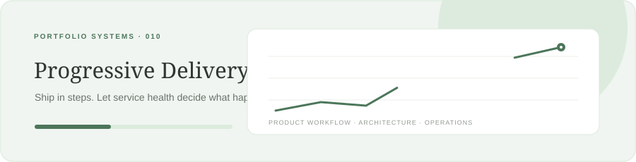

<div align="center">



# Progressive Delivery Control Plane

**Advance carefully. Pause when signals wobble. Roll back on hard failures.**

Java 21 · Spring Boot · PostgreSQL · Flyway · Docker

</div>

A portfolio API for staged software releases. It stores a rollout plan, accepts service health observations, and makes a deterministic advance, pause, or rollback decision with a recorded explanation.

## Implemented

- POST /api/releases validates an increasing set of traffic percentages ending at 100.
- POST /api/releases/{id}/start transitions a new release to active.
- POST /api/releases/{id}/metrics evaluates p95 latency, error rate, and sample volume.
- Low sample volume or a soft threshold pauses the release; hard thresholds roll it back; healthy metrics advance exactly one configured step.
- POST /api/releases/{id}/resume resumes paused releases.
- GET release and evaluation history endpoints, optimistic version field, Postgres/Flyway schema, Actuator health/metrics, Docker Compose.

Default policy in this demo: under 100 samples pauses; error rate >= 5% or p95 >= 1500 ms rolls back; error rate >= 2% or p95 >= 1000 ms pauses. These are sample policy values, not universal SLO recommendations.

## Run

```bash
docker compose up --build
```

Create a plan and begin rollout:

```bash
curl -X POST http://localhost:8080/api/releases -H 'Content-Type: application/json' \
  -d '{"service":"checkout","environment":"staging","artifactRef":"sha256:demo-build","rolloutSteps":"5,25,50,100"}'
curl -X POST http://localhost:8080/api/releases/<release-id>/start
```

Submit an observation:

```bash
curl -X POST http://localhost:8080/api/releases/<release-id>/metrics -H 'Content-Type: application/json' \
  -d '{"errorRate":0.004,"latencyP95Ms":420,"sampleCount":1500}'
```

## Decision flow

```text
release plan -> active step -> metric observation -> policy evaluation
                                          |              +-> next step
                                          |              +-> pause / resume
                                          |              +-> rollback state
                                          +-> immutable evaluation history
```

## Boundaries

This service records desired traffic percentage and decisions; it does not control Kubernetes, a service mesh, CI/CD, or cloud routing. Metrics are caller-submitted and unauthenticated in this portfolio slice. A production control plane needs workload identity, signed/verified telemetry, environment authorization, audit controls, concurrency/idempotency design, and a deployment adapter with reconciliation.

## License

MIT. See LICENSE.

